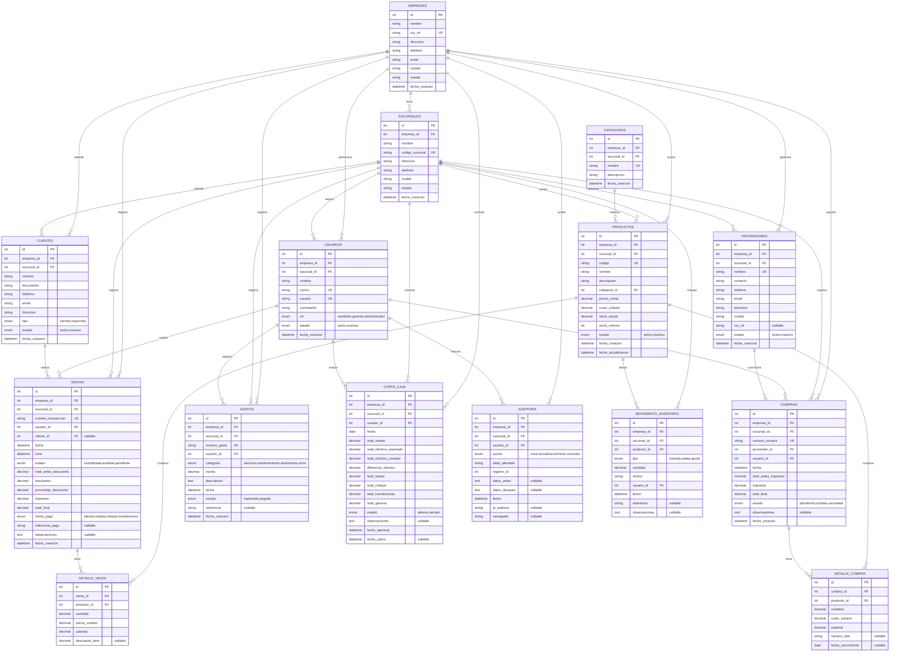

# Diagrama Entidad-Relación (ER) - Sistema POS Abarrotes y Frutería

## Mermaid ER Diagram

---

## Descripción de Relaciones

| Relación | Descripción |
|----------|------------|
| EMPRESAS → SUCURSALES | Una empresa tiene múltiples sucursales |
| SUCURSALES → USUARIOS | Una sucursal tiene múltiples usuarios |
| SUCURSALES → PRODUCTOS | Cada sucursal gestiona su inventario |
| SUCURSALES → VENTAS | Cada venta pertenece a una sucursal |
| SUCURSALES → COMPRAS | Cada compra se registra en una sucursal |
| SUCURSALES → GASTOS | Cada gasto se reporta por sucursal |
| USUARIOS → VENTAS | Un usuario realiza múltiples ventas |
| PRODUCTOS → DETALLE_VENTA | Un producto aparece en múltiples detalles de ventas |
| PRODUCTOS → DETALLE_COMPRA | Un producto aparece en múltiples detalles de compras |
| CLIENTES → VENTAS | Un cliente realiza múltiples ventas |
| PROVEEDORES → COMPRAS | Un proveedor suministra múltiples compras |
| CATEGORIAS → PRODUCTOS | Una categoría clasifica múltiples productos |

---

## Consideraciones de Diseño

### Llaves Primarias
- Todas las tablas tienen un `id` auto-incremental como PK.
- Se utiliza `SERIAL` en PostgreSQL.

### Llaves Foráneas (FK)
- `empresa_id` y `sucursal_id` permiten controlar datos por empresa y sucursal.
- Se recomienda `ON DELETE RESTRICT` para evitar pérdida accidental de datos.

### Campos Únicos (UK)
- Códigos de productos, transacciones, compras y sucursales.
- Correos y usuarios únicos.
- Nombre de proveedores único.

### Campos Nullable
- Cliente en ventas cuando no se registra un cliente.
- Referencia de pago opcional.
- Observaciones y detalles opcionales.

### Auditoría
- La tabla `AUDITORIA` registra operaciones importantes por empresa y sucursal.
- Los campos `datos_antes` y `datos_despues` pueden guardarse en JSON.

### Performance
- Índices se recomiendan en las claves foráneas y campos de búsqueda frecuente.
- Se recomienda un índice compuesto por `(sucursal_id, fecha)` para reportes.
